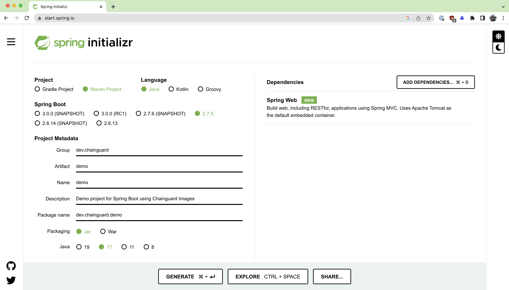
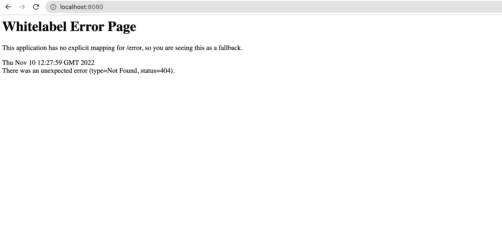

<!--monopod:start-->
# maven
| | |
| - | - |
| **OCI Reference** | `cgr.dev/chainguard/maven` |


* [View Image in Chainguard Academy](https://edu.chainguard.dev/chainguard/chainguard-images/reference/maven/overview/)
* [View Image Catalog](https://console.enforce.dev/images/catalog) for a full list of available tags.
* [Contact Chainguard](https://www.chainguard.dev/chainguard-images) for enterprise support, SLAs, and access to older tags.*

---
<!--monopod:end-->

<!--overview:start-->
Minimal image with Maven build system.
<!--overview:end-->

<!--getting:start-->
## Get It!
The image is available on `cgr.dev`:

```
docker pull cgr.dev/chainguard/maven:latest
```
<!--getting:end-->

<!--body:start-->
## Using Maven

Chainguard Maven images come with different versions of OpenJDK, ensure you choose the correct image tag for your application needs.  In these examples we will use a Chainguard Maven image based on OpenJDK 17.

Check the maven version
```
docker run --rm --platform=linux/amd64 cgr.dev/chainguard/maven:openjdk-17 --version
```

### Examples

#### SpringBoot

Visit https://start.spring.io

Select the following options:

1. __Project__: select `Maven Project`
2. __Spring Boot__: latest GA version, e.g. `2.7.5`
3. __Project Metadata__: populate your application details
4. __Packaging__: select your packaging. For this demo, we'll use `jar`
5. __Java__: select Java version, e.g. `17` that matches the OpenJDK image version we are building with
6. __Dependencies__: choose your dependencies, e.g. `Spring Web`
7. __Generate__: Hit that generate button!




Go to your downloaded zip file, unzip
```sh
mkdir ~/chainguard-sb
cd chainguard-sb
mv ~/Downloads/demo.zip .
unzip demo.zip
cd demo
```

You now have your generated Spring Boot application souce code.  Now let's build it.

```sh
docker run --platform=linux/amd64 --rm -v ${PWD}:/home/build cgr.dev/chainguard/maven:openjdk-17 clean install
```

Check to see your compiled `jar` file
```sh
find target -name "*.jar"
```
You should see...
```
target/demo-0.0.1-SNAPSHOT.jar
```

Let's run the application using the Chainguard OpenJDK JRE image.  _Note_ there's a few things happening here and this is just for test purposes, see section below for more real world scenarios.

Choose the Chainguard OpenJDK JRE image tag that matches your application's Java version selected when generating your Spring Boot application above.

```
docker run --platform=linux/amd64 --rm -p 8080:8080 -v ${PWD}/target:/app/ cgr.dev/chainguard/jre:openjdk-17 -jar /app/demo-0.0.1-SNAPSHOT.jar
```

Now visit the Spring Boot Application in your browser using the same port mapped in the docker command above.

e.g http://localhost:8080/



Note this is the expected Spring Whitelabel error page.


#### Multistage Dockerfile

The steps above are useful to test Chainguard images however, we can now create a multistage Dockerfile that will build a smaller image to run our demo application.

First create a `.dockerignore` file so we don't copy the generated maven `./target` folder from the steps above into the multistage docker build.  This helps avoid any permission errors during the build.

```sh
cat <<EOF >>.dockerignore
target/
EOF
```

Next create the multistage `Dockerfile`

```dockerfile
cat <<EOF >>Dockerfile
FROM cgr.dev/chainguard/maven:openjdk-17

WORKDIR /home/build

COPY . ./

RUN mvn install

FROM cgr.dev/chainguard/jre:openjdk-17

COPY --from=0 /home/build/target/demo-*.jar /app/demo.jar

CMD ["-jar", "/app/demo.jar"]
EOF
```

Build your application image
```sh
docker build --platform=linux/amd64 -t my-chainguard-springboot-app .
```

Now run your application
```sh
docker run --platform=linux/amd64 --rm -p 8080:8080 my-chainguard-springboot-app
```
Again visit the Spring Boot Whitelabel page in your browser

e.g. http://localhost:8080/


### What's inside?

Now let's take a closer look at your newly built image.

Check the size of your image, as this is based on Chainguard images it will only contain the Linux packages required to run your application.  The reduces the number of packages that can be affected by CVEs.

```sh
docker images | grep my-chainguard-springboot-app
```

You can also check for vulnerabilities using your favorite scanner.
<!--body:end-->
