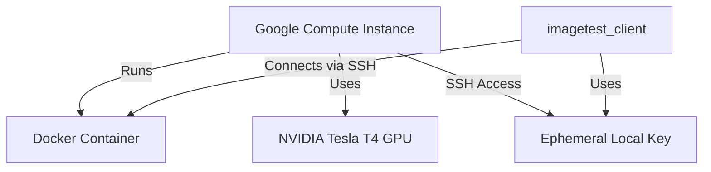

# gpu pterraform harness

This module contains the iac required to spin up a `gpu` enabled container on a remote harness, namely, on GCE.

This is **not** intended to be run independently, but via
`imagetest_harness_pterraform`, as such, inputs to otherwise required variables
(like project and zone) are **not** exposed, rather they are to be configured
by the hosts environment variables.

```bash
GOOGLE_PROJECT="foo" GOOGLE_ZONE="us-central1-a" terraform apply
```

A rough diagram of the infrastructure is below:


